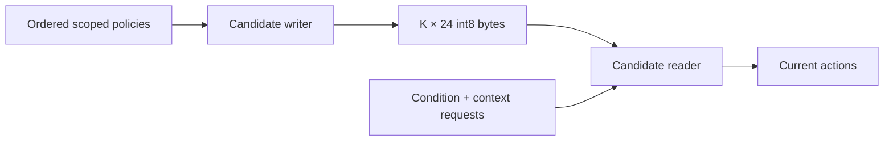

# Scoped Policy Memory Take-Home

You have 90 minutes to design, train, and evaluate a bounded policy-memory
mechanism. Read [TASK.md](TASK.md) before you edit the code.

## Problem

The model receives an ordered policy list. Each policy contains a condition, a
context scope, an action, a priority, and noisy context-traffic estimates.

Later policies can replace part of an earlier policy scope. The earlier policy
remains active in all contexts that the later policies do not cover.

The model must compile the list into `K` memory slots. It then discards every
policy state and answers requests from the bounded memory alone.

You control the writer and reader in `src/memory_tokens/candidate.py`.



## Independent axes

- Public policy counts are 8, 16, 32, and 64. The holdout uses 128.
- Public memory counts are 2, 4, 8, 16, and 32.
- Public traffic is uniform or Zipf. Training also uses bimodal traffic.
- Public estimate noise is 0.0 or 0.5. The holdout uses 1.0.
- Training scopes are singleton or nested. The holdout uses crossing scopes.
- The partial-policy rate also changes on the holdout.

Evaluation reports overall, conflict, hot, cold, common-context, and
rare-context accuracy. The public sweep contains 80 cells.

## Hard boundary

- Model-state width: 96 values.
- Memory-slot width: 24 signed bytes.
- Payload shape: `[B, K, 24]`.
- Fixed quantization scale: `0.125`.
- Exact capacity: `24K` bytes, or `192K` bits, per example.
- Other sample-dependent state: prohibited.

The evaluator controls int8 conversion. Only the decoded byte payload reaches
the reader.

## Candidate rules

- Edit `src/memory_tokens/candidate.py`, `SUBMISSION.md`, and `artifacts/` only.
- Do not edit the model, generator, trainer, protocol, or tests.
- Do not use pretrained weights or external training data.
- Do not keep policy data in attributes, caches, containers, or side channels.
- Use one parameter set for every tested value of `K`.
- You may use web search, documentation, AI agents, and IDE assistants.
- You are responsible for the code, measurements, and conclusions.

## Start

Use Python 3.13 and `uv`.

```bash
uv sync --extra test
uv run ruff check .
uv run ruff format --check .
uv run pytest
uv run python -m memory_tokens.train \
  --steps 40 --quick-check --output artifacts/quick-model.pt
```

## Files

| Path | Purpose |
|---|---|
| `TASK.md` | full semantics, protocol, commands, and scoring |
| `src/memory_tokens/candidate.py` | candidate-owned writer and reader |
| `SUBMISSION.md` | required report template |
| `src/memory_tokens/` | fixed model, data, training, and evaluation code |
| `tests/` | public contract tests |
| `artifacts/` | checkpoint and experiment outputs |
