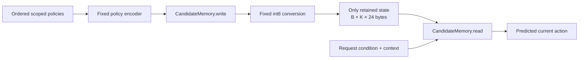
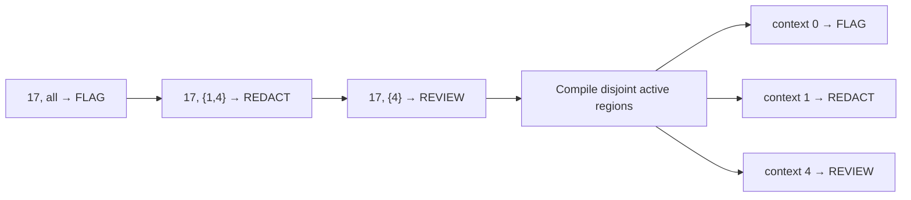

# Task: Scoped Policy Memory Under a Hard Budget

You have 90 minutes. This time includes experiments and the report.

## Situation

A request model receives an ordered policy list. Each policy maps a condition
and a context scope to an action.

The model reads the list once. It then discards the policy states and keeps a
small byte payload. Later, it must answer requests from that payload alone.

Policies can overlap. A later policy can replace an earlier policy in some
contexts while the earlier policy remains active in other contexts.

The writer also receives noisy context-traffic estimates for each policy.
These values measure matching traffic, not traffic for which that policy wins.
Overlapping policies can therefore report the same traffic mass.

Your task is to replace the supplied memory bridge. A good bridge must do all
of these operations:

- compile partial overrides into active rule regions;
- estimate the residual value of each active region;
- allocate limited memory across common and rare contexts;
- compress the selected rule information into signed bytes; and
- retrieve an action by condition and request context.

You must train one model for all policy counts and memory budgets. You must
also predict performance on a larger, shifted holdout before you run it.



The data is synthetic. This isolates rule compilation, compression, retrieval,
training, and evaluation from language parsing.

## Policy definitions

An **example** contains one ordered policy list and one request set.

A **condition** is an integer token in `[0, 256)`. Token meanings change across
examples. A model cannot use a fixed condition-to-action table.

A **context** is an integer in `[0, 8)`. Contexts represent separate request
environments, such as products, regions, or customer classes.

A **scope** is an unsigned eight-bit mask. Bit `s` is one when the policy
applies to context `s`.

An **action** is an integer class in `[0, 256)`. The first four actions appear
as `ALLOW`, `FLAG`, `REVIEW`, and `REDACT` in examples only.

A **policy** at index `i` has this form:

```text
(condition_i, scope_i, action_i, priority_i=i, traffic_estimate_i)
```

A policy matches a request when both conditions are true:

```text
policy_condition == request_condition
scope & (1 << request_context) != 0
```

The matching policy with the largest valid index supplies the target action.
Thus, priority applies separately to every condition-context pair.

Each condition has an initial policy with scope `0b11111111`. Partial policies
come later. This rule guarantees an action for every generated request.

A **conflict request** matches two or more policies. A **single-rule request**
matches one policy.

The policy mask marks valid policies. A false value marks padding and cannot
match a request.

## Partial override example

The list contains three policies for condition `17`:

| Index | Scope | Action | Effect |
|---:|---|---|---|
| 0 | all contexts | `FLAG` | base action |
| 1 | contexts 1 and 4 | `REDACT` | partial override |
| 2 | context 4 | `REVIEW` | later partial override |

The final actions are:

| Request | Target |
|---|---|
| condition 17, context 0 | `FLAG` |
| condition 17, context 1 | `REDACT` |
| condition 17, context 4 | `REVIEW` |



Removing policy 0 would be incorrect. It remains active in six contexts.
Keeping only the last policy for condition 17 would also be incorrect.

## Traffic and metadata

The generator assigns a true probability to every condition-context pair.
Requests are sampled from this joint distribution.

`uniform` uses equal condition and context weights. `zipf` uses a long-tailed
condition distribution and condition-specific context skew.

Training also uses `bimodal`. The holdout uses unseen `lognormal` condition and
context weights.

The generator adds independent log-normal noise to each pair probability:

```text
estimated_weight[c, s] = true_weight[c, s] * exp(epsilon[c, s])
epsilon[c, s] ~ Normal(0, sigma^2)
```

It normalizes these values across all pairs. Each policy receives the eight
estimated pair probabilities for its condition. Values outside its scope are
zero. It also receives their sum.

The estimate is not residual policy value. A later overlapping policy can make
part of an earlier estimate obsolete. The writer must account for this effect.

A **hot request** belongs to the highest-probability quartile of all pairs. A
**cold request** belongs to the other three quartiles.

A **rare context** belongs to the lower half of contexts by total true traffic.
These labels enter evaluation only.

## Scope geometry

`singleton` partial policies apply to one context.

`nested` partial policies apply to short circular context ranges. Public
evaluation uses this profile.

`crossing` partial policies use arbitrary nonempty, non-global masks. These
masks can overlap without containment. The holdout uses this unseen profile.

Training mixes `singleton` and `nested` scopes. It never uses `crossing` scopes.

## Tensor contract

The fixed model width is `D=96`. The memory width is `M=24`.

`CandidateMemory.write` receives policy states with shape `[B, N, D]`. It also
receives the policy mask and `K`.

The fixed encoder keeps these addressable fields in each policy state:

| Coordinates | Width | Content |
|---|---:|---|
| `0` | 1 | signed condition token code, multiplied by `0.125` |
| `1:24` | 23 | learned condition key |
| `24:32` | 8 | scope bits as zero or one |
| `32:40` | 8 | noisy context-traffic estimates |
| `40:55` | 15 | contextual policy state |
| `55` | 1 | sum of the context-traffic estimates |
| `56:80` | 24 | action payload |
| `80:96` | 16 | contextual policy state |

Equal condition codes identify equal condition tokens. The writer can read
scope bits and the noisy estimates directly.

`CandidateMemory.read` receives request states with shape `[B, R, D]`. Request
coordinate `0` contains the same signed condition code. Coordinates `1:24`
contain its learned key. Coordinates `24:32` contain the one-hot context.

The writer must return one finite `float32` tensor with shape `[B, K, 24]`.
The evaluator converts each proposed value to a signed byte:

1. Divide the value by `0.125`.
2. Round the result to the nearest integer.
3. Clamp the result to `[-128, 127]`.
4. Store the result as `torch.int8`.
5. Decode the byte before the reader runs.

Only `24K` bytes can contain sample-dependent policy information. Learned
parameters shared by all examples are permitted.

Do not store batch data in a module attribute, global variable, cache,
container, closure, or other side channel.

## Data fields

The generator returns these fields for tests and evaluation:

| Field | Shape | Meaning |
|---|---|---|
| `policy_conditions` | `[B, N]` | ordered condition tokens |
| `policy_scopes` | `[B, N]` | eight-bit context masks |
| `policy_actions` | `[B, N]` | ordered action tokens |
| `policy_mask` | `[B, N]` | valid-policy mask |
| `policy_request_probability_estimates` | `[B, N]` | noisy matching-traffic estimates |
| `policy_context_probability_estimates` | `[B, N, 8]` | noisy estimates by context |
| `request_conditions` | `[B, R]` | requested conditions |
| `request_contexts` | `[B, R]` | requested contexts |
| `targets` | `[B, R]` | actions from the last matching policies |
| `request_conflicts` | `[B, R]` | multiple-match labels |
| `request_probabilities` | `[B, R]` | true pair probabilities for evaluation |
| `request_hot` | `[B, R]` | hot-pair labels for evaluation |
| `request_rare_context` | `[B, R]` | rare-context labels for evaluation |

The bridge receives encoded states, the policy mask, and `K`. It does not
receive the raw batch fields.

## Your work

You may edit only these locations:

- `src/memory_tokens/candidate.py`
- `SUBMISSION.md`
- `artifacts/`

Do not edit the generator, fixed model, trainer, protocol, or tests.

You can change the writer, reader, and optional auxiliary loss. One set of
parameters must support every tested value of `K`.

You may use web search, documentation, AI agents, and IDE assistants. You are
responsible for all code, measurements, and conclusions.

Do not use pretrained weights or external training data.

## Required experiment

1. Run all tests and one quick training check.
2. Implement and train one memory mechanism.
3. Evaluate all 80 public cells.
4. Report overall accuracy and a 95% Wilson interval for each cell.
5. Analyze conflict, cold, and rare-context accuracy.
6. Commit a capacity prediction before you run the holdout.
7. Run the holdout after the prediction file exists.
8. Complete `SUBMISSION.md`.

The public sweep uses these values:

- `N in {8, 16, 32, 64}` policies
- `K in {2, 4, 8, 16, 32}` memory slots
- traffic in `{uniform, zipf}`
- estimate noise `sigma in {0.0, 0.5}`
- a 35 percent partial-policy rate
- `nested` scope geometry

The holdout uses 128 policies, a 20 percent partial-policy rate, `lognormal`
traffic, noise `sigma=1.0`, and unseen `crossing` scopes.

Each evaluation cell contains at least 4,096 new request decisions. The
holdout tests fixed `K` values and the exact predicted `K`.

## Commands

Python 3.13 and `uv` are required.

```bash
uv sync --extra test
uv run ruff check .
uv run ruff format --check .
uv run pytest
```

Run a quick check:

```bash
uv run python -m memory_tokens.train \
  --steps 40 --quick-check --output artifacts/quick-model.pt
```

Train the full model:

```bash
uv run python -m memory_tokens.train \
  --steps 1000 --output artifacts/model.pt
```

Run the public sweep:

```bash
uv run python -m memory_tokens.experiment sweep \
  --checkpoint artifacts/model.pt \
  --output artifacts/sweep.json
```

Commit the prediction. Replace each uppercase value.

```bash
uv run python -m memory_tokens.experiment predict \
  --sweep artifacts/sweep.json \
  --predicted-k PREDICTED_K \
  --family "FUNCTIONAL_FAMILY" \
  --rationale "RATIONALE" \
  --output artifacts/prediction.json

git add src/memory_tokens/candidate.py artifacts/model.pt \
  artifacts/sweep.json artifacts/prediction.json
git commit -m "Commit holdout prediction"
```

Run the holdout only after that commit:

```bash
uv run python -m memory_tokens.experiment holdout \
  --checkpoint artifacts/model.pt \
  --prediction artifacts/prediction.json \
  --output artifacts/holdout.json
```

## Scoring

- public and holdout accuracy, subgroup accuracy, scaling, and prediction: 40
- hard-boundary correctness: 20
- experiment quality and prediction integrity: 20
- technical explanation and failure diagnosis: 20

A sample-dependent side channel invalidates the submission. A report cannot
replace a working implementation.

## Compute

Full training targets a recent CUDA GPU. CPU mode supports tests and quick
checks. The trainer uses mixed precision on CUDA.

If compute fails, preserve the prediction order. Report the largest valid
experiment that you completed.
